# Appendix: UML

## Ontologies

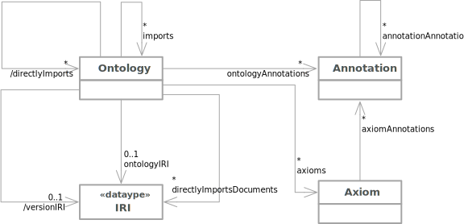

## Entities, Literal, and Anonymous Individuals

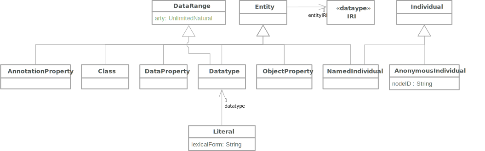

## Property Expressions

### Object Property

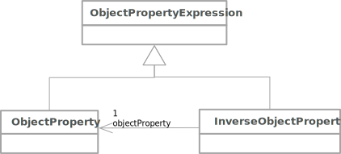

### Data Property

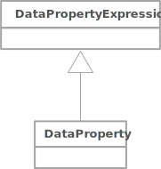

## Data Ranges

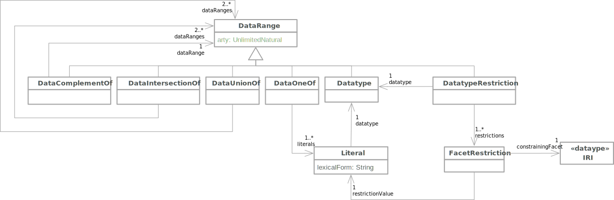

## Class Expressions

### Propositional Connectives and Enumeration of Individuals

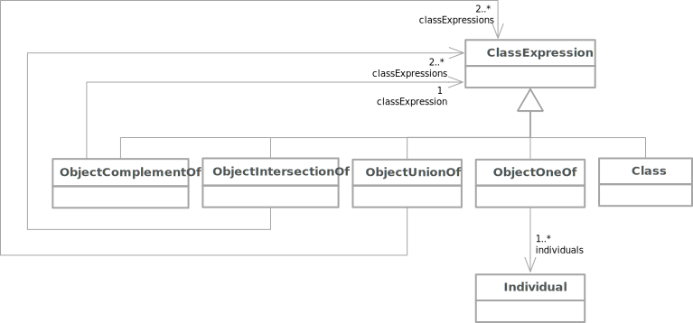

### Object Property Restrictions

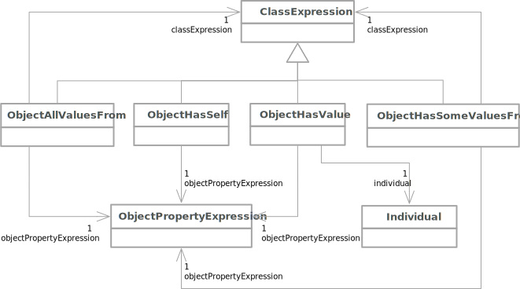

### Object Property Cardinality Restrictions

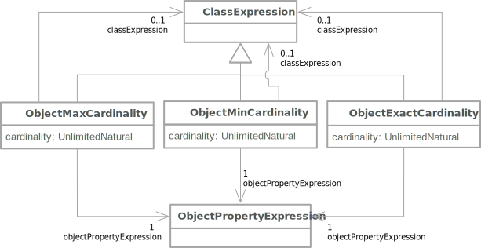

### Data Property Restrictions

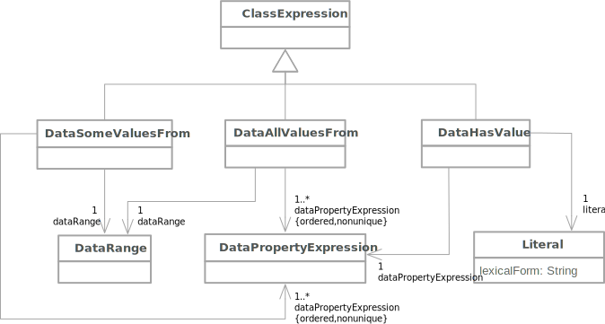

### Data Property Cardinality Restrictions

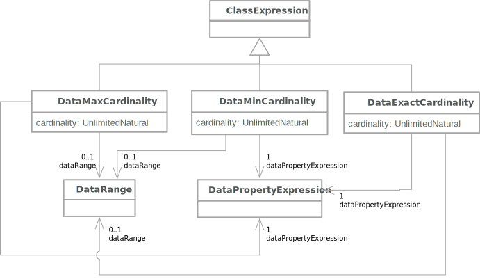

## Axioms

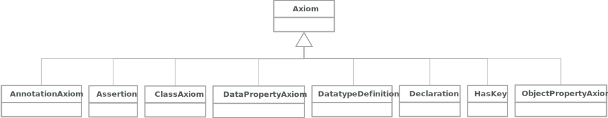

### Entity Declarations

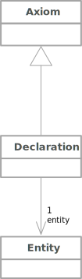

### Class Axioms

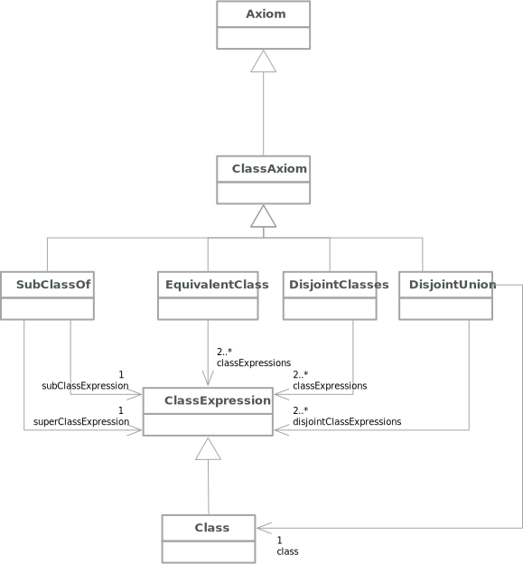

### Object Property Axioms

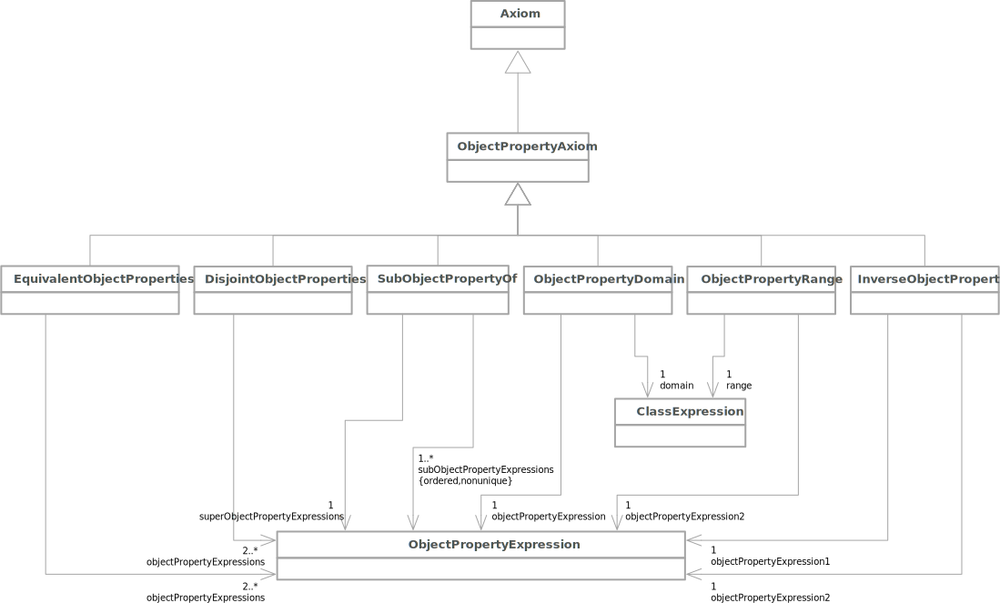

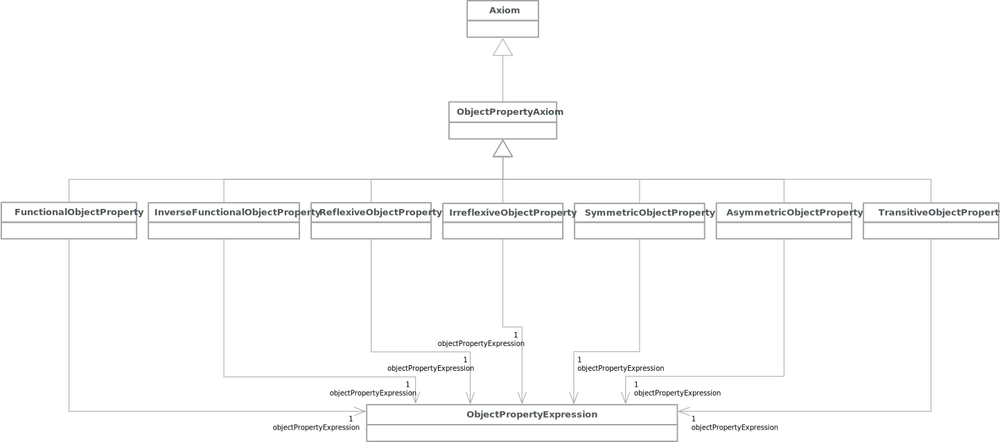

### Data Property Axioms

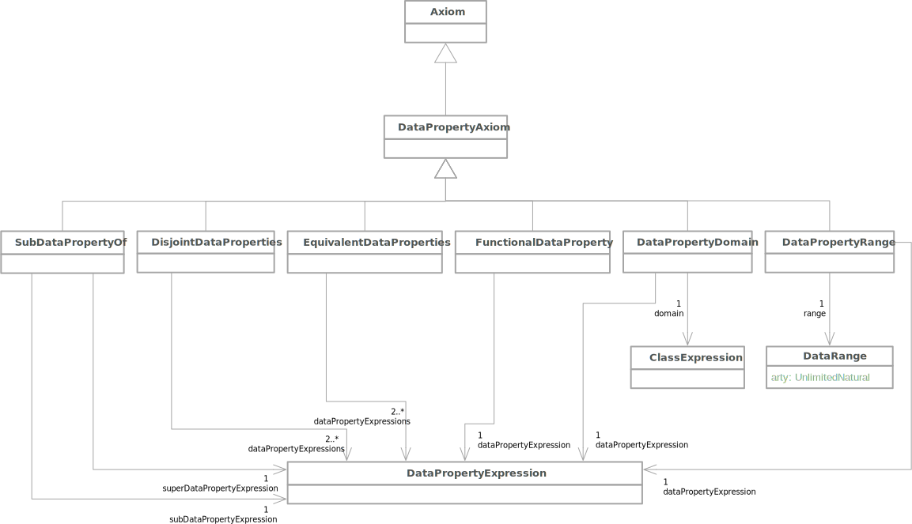

### Datatype Definition

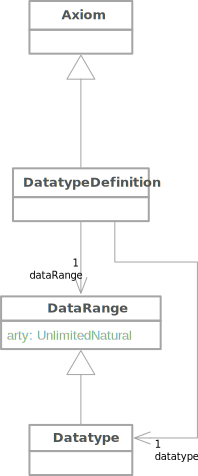

### Has Key

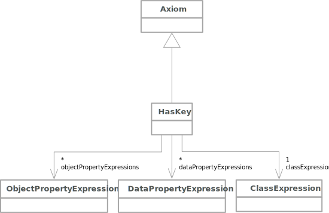

### Assertion

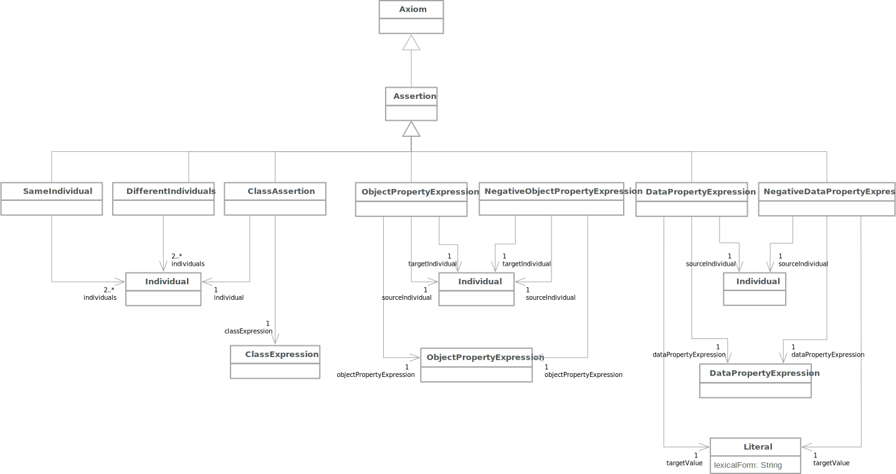

### Annotation Axiom

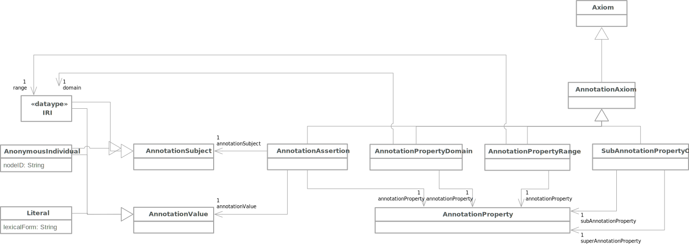

## Annotations

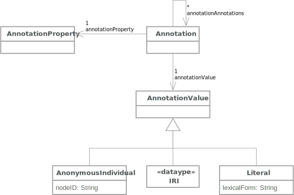
