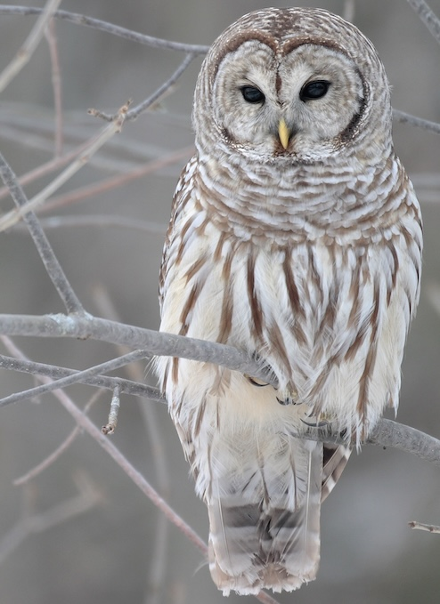

# CLI Tools



<span class="figure caption">Strix Varia -- Barred Owl</span>
<!-- Wikipedia 2026-07-13 -->

The primary command-line tool is named `hoot` and

 > *The barred owl, also known as the northern barred owl, striped owl or, more
> informally, hoot owl or eight-hooter owl, is a North American large species
> of owl. A member of the true owl family, Strigidae, they belong to the genus*
> Strix, *which is also the origin of the family's name under Linnaean
> taxonomy.* -- [Wikipedia](https://en.wikipedia.org/wiki/Barred_owl)

## Installation

## Basic Usage

```bash
❯ hoot --help
Hoot: the quick tool for OWL(s)

Usage: hoot [OPTIONS] <COMMAND>

Commands:
  check        Check one or more OWL documents for syntax correctness
  statistics   Compute statistics for the Ontology in an OWL document
  describe     Describe an OWL function
  completions  Generate command completions for a number of shells
  help         Print this message or the help of the given subcommand(s)

Options:
  -v, --verbose...    Increase logging verbosity by one level per occurance
      --quiet...      Decrease logging verbosity by one level per occurance
      --color <WHEN>  Controls when to use color [default: auto] [possible values: auto, always, never]
  -h, --help          Print help
```

### Help

### Completions

```bash
❯ hoot completions ( bash | elvish | fish | powershell | zsh )
```

### Common Arguments

* `verbose` (-v); increase logging verbosity by one level per occurance.
* `quiet`; decrease logging verbosity by one level per occurance.
* `color`*`when`*; controls when to use color; possible values: auto (default), always, never.
* `help` (-h); print help.

## Commands

* [Check](./check/index.md)
* [Describe](./describe/index.md)
* [Statistics](./stats/index.md)
* [Document](./document/index.md)
* [Draw](./draw/index.md)
* Help -- See above.
* Completions -- See above.
* External commands -- See below.

### External Commands

TBD
