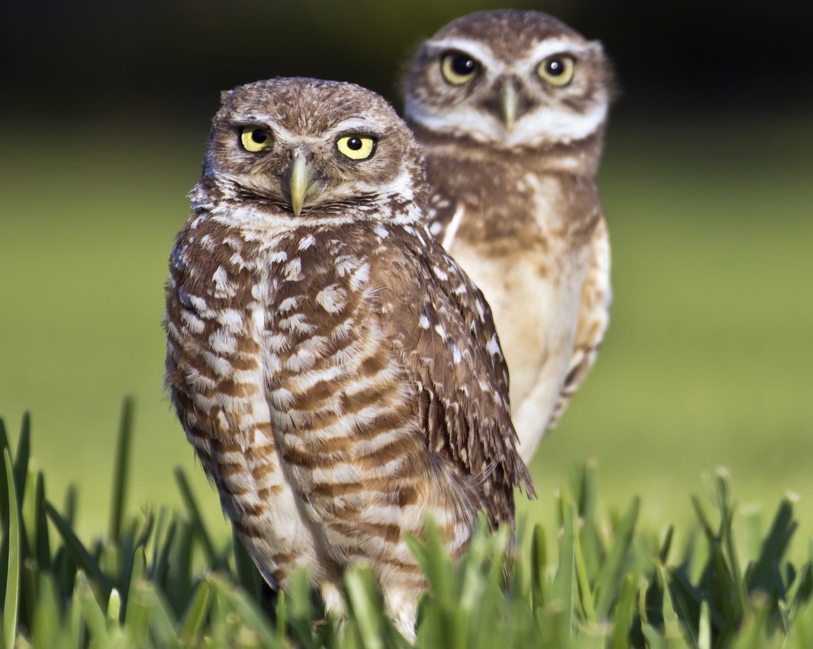

<!-- markdownlint-disable-file MD033 -->
# Introduction

[OWL 2 Web Ontology Language -- Structural Specification and Functional-Style Syntax (Second Edition)](https://www.w3.org/TR/owl2-syntax/)

## The Name "Athene"

Athene cunicularia -- Burrowing Owl
