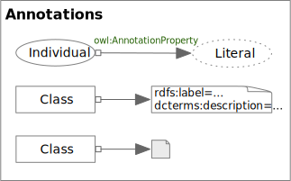
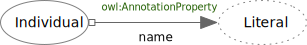
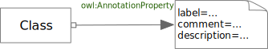

<!-- markdownlint-disable-file MD033 -->
# Annotation Properties

Annotation Properties

## Property Notation

An *AnnotationProperty* as Property Notation

### Property Notation Rules

TBD

## Axiom Notation

An *AnnotationProperty* as Axiom Notation

### Axiom Notation Rules

TBD
