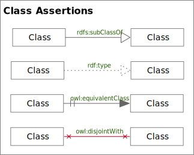

<!-- markdownlint-disable-file MD033 -->
# Class Assertions

Overview of Class Assertions

## rdfs:subClassOf

An RDF Schema *subClassOf* Edge

### rdfs:subClassOf Rules

1. The source and target of the edge **must** both be classes.

## rdf:type

An RDF *type*-of Edge

### rdf:type Rules

1. The source and target of the edge **must** both be classes.

## owl:equivalentClass

An OWL *equivalentClass* Edge

### owl:equivalentClass Rules

1. The source and target of the edge **must** both be classes.

## owl:disjointWith

An OWL *disjointWith* Edge

### owl:disjointWith Rules

1. The source and target of the edge **must** both be classes.
1. The source and target of the edge **must** not be the same.
