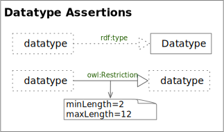
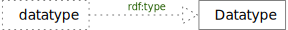
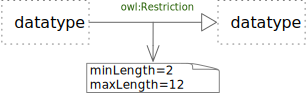

<!-- markdownlint-disable-file MD033 -->
# Datatype Assertions

Datatype Assertions

## rdf:type

An RDF *type*-of Edge

### rdf:type Rules

TBD

## Datatype owl:Restriction Notation

An OWL *Restriction* Edge and Axiom Node

### Datatype owl:Restriction Rules

TBD
