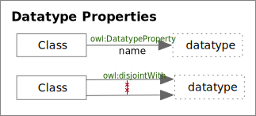
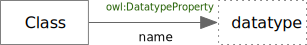
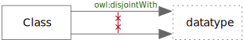

<!-- markdownlint-disable-file MD033 -->
# Datatype Properties

Datatype Properties

## owl:DatatypeProperty

An OWL *DatatypeProperty* Edge

### owl:DatatypeProperty Rules

TBD

## owl:disjointWith

An OWL *disjointWith* Edge

### owl:disjointWith Rules

TBD
