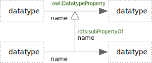

<!-- markdownlint-disable-file MD033 -->
# Datatype Properties

Datatype Properties

## owl:DatatypeProperty

An OWL *DatatypeProperty* Edge

### owl:DatatypeProperty Rules

1. The source of the edge **must** be a class, and the target **must** be a Datatype.
2. The edge **must** be named.

## rdfs:subPropertyOf

An RDF Schema *subPropertyOf* Edge

### rdfs:subPropertyOf Rules

1. The source and target of the edge **must** both be Datatype Properties.
2. The edge **must** be named.

## owl:disjointWith

An OWL *disjointWith* Edge

### owl:disjointWith Rules

1. The source and target of the edge **must** both be Datatype Properties.
