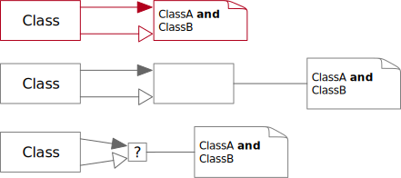
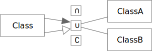
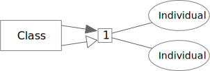
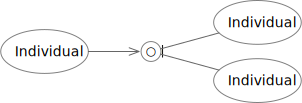
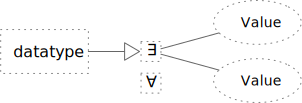

# Class and Value Expressions



## Logical



```turtle
:exampleProperty a owl:ObjectProperty ;
  rdfs:subPropertyOf owl:topObjectProperty ;
  rdfs:domain :Class ;
  rdfs:range [
    a owl:Class ;
    owl:unionOf (
      :ClassA
      :ClassB
    )
  ] .
```

### Logical Rules

TBD

## Enumeration



### Enumeration Rules

TBD

## All Different



### All Different Rules

TBD

## Datatype Restrictions



### Datatype Restrictions Rules

TBD
