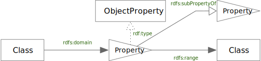
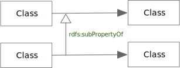
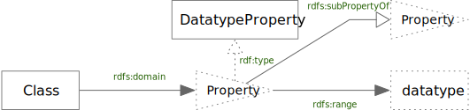
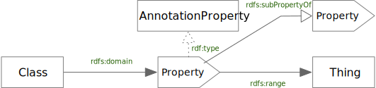

<!-- markdownlint-disable-file MD033 -->
# Extended Property Notation

## Object Properties

Object Property Extended Notation

TBD

### ObjectProperty Node Rules

1. There **must** be exactly one *ObjectProperty* edge for which this node is the
   target; the property denotes the source *Class* as the *domain* of the property.
2. There **must** be exactly one *ObjectProperty* edge for which this node is the
   source; the property denotes the target as the *range* of the property.
3. The node **may** be the source of any number of RDF *type* edges, but the edge
   target **must** be a sub-class of `owl:ObjectProperty`.
4. The node **may** be the source of any number of RDF Schema *subPropertyOf* edges,
   but the edge target **must** be another ObjectProperty node.

### Simple ObjectProperty subPropertyOf

## Datatype Properties

Datatype Property Extended Notation

TBD

### DatatypeProperty Node Rules

1. There **must** be exactly one *ObjectProperty* edge for which this node is the
   target; the property denotes the source *Class* as the *domain* of the property.
2. There **must** be exactly one *DatatypeProperty* edge for which this node is the
   source; the property denotes the target as the *range* of the property.
3. The node **may** be the source of any number of RDF *type* edges, but the edge
   target **must** be a sub-class of `owl:DatatypeProperty`.
4. The node **may** be the source of any number of RDF Schema *subPropertyOf* edges,
   but the edge target **must** be be another DatatypeProperty node.

## Annotation Properties

Datatype Annotation Extended Notation

TBD

### AnnotationProperty Node Rules

1. There **must** be at most one *ObjectProperty* edge for which this node is the
   target; the property denotes the source *Class* as the *domain* of the property.
   1. It is common for the domain to be left unspecified for annotation properties
      to allow for their wide use across different cases.
2. There **must** be at mose one *DatatypeProperty* edge for which this node is the
   source; the property denotes the target as the *range* of the property.
   1. It is common for the range to be left unspecified for annotation properties
      to allow for their wide use across different cases.
3. The node **may** be the source of any number of RDF *type* edges, but the edge
   target **must** be a sub-class of `owl:AnnotationProperty`.
4. The node **may** be the source of any number of RDF Schema *subPropertyOf* edges,
   but the edge target **must** be be another AnnotationProperty node.
