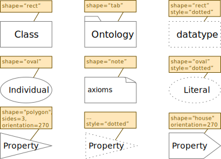
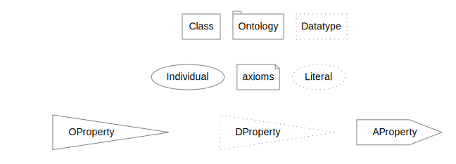
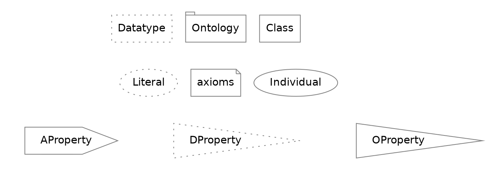
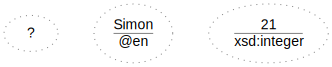

<!-- markdownlint-disable-file MD033 -->
# Appendix: GraphViz

## Nodes

Default node configuration.

```dot
node [fontname="Helvetica", fontcolor="black", color="#808080"];
```



### GraphViz Rendering



<details>
  <summary>Show dot source</summary>



</details>

### Literals



<details>
  <summary>Show dot source</summary>


</details>

## Edges
