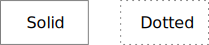
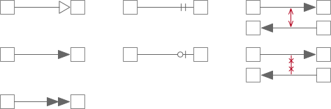

# Nocturn: A Visual Language for OWL

Nocturn is another entry in the space of visual representations for OWL, and
therefore RDF Schema as well. It's intent is to be as simple as possible for
the most common cases, with extensibility for complex scenarios. Nocturn
(named for a species of owl, *Athene noctua*, the little owl) tries to use
as few basic building blocks as possible, with strict rules on presentation
and style to allow for even simple tools such as [GraphViz](https://graphviz.org)
to be used as a renderer.

Some attempts at visual representations have proven too simple and make it
very hard to represent even mildly complex cases, others have a set of so
many low-level primitives that a representation of a mildly complex case
looks like a spider-web of interconnected nameeless nodes.

## Common Notation Rules

1. Node and Edge Lines
   1. Line strokes **must** be single, with no shadows or other effects.
   1. Line weights **must** be light, in the `0.75..=1.75pt` range.
   1. Line color **must** be dimmer than that of the text so that the text is
      more readable. The examples here use the SVG color name `gray` or the
      RGB value `#808080`.
2. Node Labels
   1. Labels **must** be centered horizontally and **should** be centered
      vertically.
   2. **Do not** use font styles, bold, italic, or other forms for name
      labels.
   3. **Do not** use color for name labels.
3. Whether to display prefixes for names is a tool choice, but **must** be
   available to the user to disambiguate same names in different namespaces.

### Line Styles

In some cases ...

### Edge Shapes

