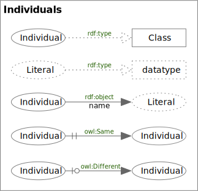
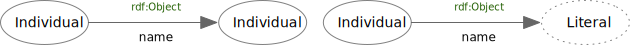
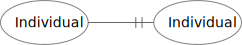
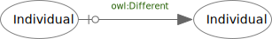

<!-- markdownlint-disable-file MD033 -->
# Individual Assertions

Individual Assertions

## Property Assertion

An RDF *object* Edge

## owl:sameAs

An OWL *sameAs* Edge

### owl:sameAs Rules

TBD

## owl:differentFrom

An OWL *differentFrom* Edge

### owl:differentFrom Rules

TBD
