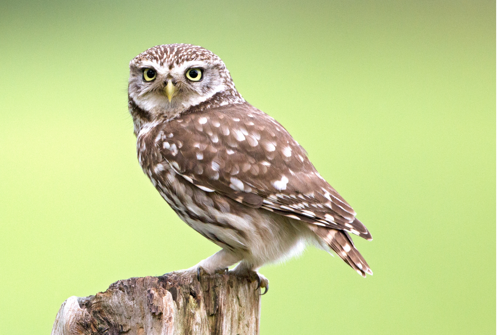
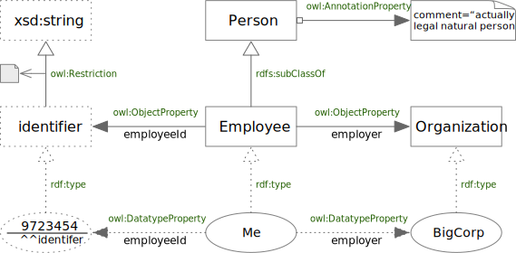
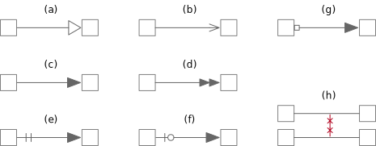

<!-- markdownlint-disable-file MD033 -->
# Nocturn: A Visual Language for OWL



<span class="figure caption">Athene noctua -- Little Owl</span>

Nocturn is another entry in the space of visual representations for OWL, and
therefore RDF Schema as well. It's intent is to be as simple as possible for
the most common cases, with extensibility for complex scenarios. Nocturn
(named for a species of owl, *Athene noctua*, the Little Owl) tries to use
as few basic building blocks as possible, with strict rules on presentation
and style to allow for even simple tools such as [GraphViz](https://graphviz.org)
to be used as a renderer.

Some attempts at visual representations have proven too simple and make it
very hard to represent even mildly complex cases, others have a set of so
many low-level primitives that a representation of a mildly complex case
looks like a spider-web of interconnected nameless nodes.

At the end of some chapters there will be sections entitled *Tool Notes* and
these will be non-normative thoughts on tool implementations for supporting
Nocturn. These may be suggestions on interaction with the visual representation,
possible ways of scaling to multi-ontology editing, and so on, but may
provide useful insights beyond the language definition itself.

## Example

The following is a simple model showing three classes, `Person`, `Employee`,
and `Organization` along with a new datatype `Identifier`. Through the rest of
this book, we will use the smaller, green, italic, type to indicate the
underlying RDF, RDF Schema, or OWL relationship that a visual structure
represents. So, you can see the sub-class relationship between employee and
person, and so forth.



<span class="figure caption">Simple Employee Ontology</span>

The example also shows how the individuals `Me`, `BigCorp`, and
`9723454^^:identifier` are related to their types and to each other.

The following is the same model in Turtle. Note that examples throughout
will typically show either Turtle or the OWL Functional Syntax and sometimes
both.

```turtle
:Person a owl:Class ;
    rdfs:comment "actually a legal natural person" .

:Employee a owl:Class ;
    rdfs:subClassOf :Person .

:Organization a owl:Class .

:identifier a rdfs:Datatype 
    owl:onDatatype xsd:string ;
    owl:withRestrictions (
        [ xsd:pattern "^\\d{5,10}-[A-Z]{1}\\d{5}$" ]
    ) .

:employeeId a owl:DatatypeProperty .
    rdfs:domain :Employee ;
    rdfs:range :identifier .

:employer a owl:ObjectProperty .
    rdfs:domain :Employee ;
    rdfs:range :Organization .

:BigCorp a :Organization .

:Me a :Employee ;
    :employeeId "9723454"^^:identifier ;
    :employer :BigCorp .
```

## Common Notation Rules

1. Node and Edge Lines
   1. Line strokes **must** be single, with no shadows or other effects.
   1. Line weights **must** be light, in the `0.75..=1.75pt` range.
   1. Line color **must** be dimmer than that of the text so that the text is
      more readable. The examples here use the SVG color name `gray` or the
      RGB value `#808080`.
2. Node Labels
   1. Labels **must** be centered horizontally and **should** be centered
      vertically.
   2. **Do not** use font styles, bold, italic, or other forms for name
      labels.
   3. **Do not** use color for name labels.
3. Whether to display prefixes for names is a tool choice, but **must** be
   available to the user to disambiguate same names in different namespaces.

### Line Styles

To denote classes and individuals from datatypes and literals Nocturn uses
solid vs. dotted lines as shown in the following figure.


<span class="figure caption">Line Styles</span>

### Edge Ending Shapes



<span class="figure caption">Edge Ending Shapes</span>

<ol type="a">
  <li>An open, equilateral triangle, denoting a <i>sub-type relation</i>. Hereafter termed <i>open triangle</i>.</li>
  <li>An open arrow head, generally with the same proportions as (a). Hereafter termed <i>stick arrow</i>.</li>
  <li>A closed, isosceles triangle with a narrow base, denoting an
      <code>owl:ObjectProperty</code>. Hereafter termed <i>filled triangle</i>.</li>
  <li>A double closed, isosceles triangle with a narrow base, denoting an
      <code>owl:TransitiveProperty</code> property. Hereafter termed <i>double open triangle</i>.</li>
  <li>Two short perpendicular lines across the edge at the source, denoting
      an <i>equivalence relation</i>. Note that the target end <b>must</b> be
      a (c) triangle. Hereafter termed <i>double bar</i>.</li>
  <li>An open circle and one short perpendicular lines across the edge at the
      source, denoting a <i>negative equivalence relation</i>. Note that the
      target end <b>must</b> be a (c) triangle. Hereafter termed <i>bar and circle</i>.</li>
  <li>An open square at the source, attached to the shape, denoting an
      <code>owl:AnnotationProperty</code>. Note that the target end <b>must</b>
      be a (c) triangle. Hereafter termed <i>open box</i>.</li>
  <li>Two short lines crossing the edge at both source and target, denoting an
      <code>owl:disjointWith</code> relation. Hereafter termed <i>crosses</i>.</li>
</ol>

In the above notation the use of a small circle on the non-equivalent
relationship denoting *negation* is used in the same manner as the common
notation in circuit symbols for logic gates *nand*, *nor* and so forth.

## Tool Notes

There are a number of use cases where a tool needs to indicate a **Focus Element**
whether a node or edge. For example, you search for a node by name, you ask to
create a new view with all relations radiating from a given starting node, etc. In
such cases the easiest and most in-line with the style rules above is to increase
the weight of the element; increase the line weight, increase the size of (probably
only directly attached) edge shapes, increase the weight of the node's label and so
forth.
