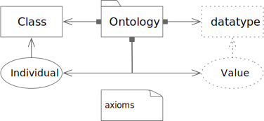
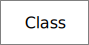
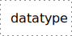
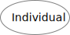
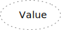
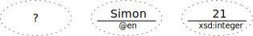
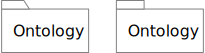
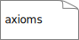

# Nodes



## Class Notation



### Class Rules

1. The overall shape is a rectangle, it's **must** be greater than it's height,
   and corners **must** be hard, not rounded.
2. Node lines **must** be solid.

## Datatype Notation



### Datatype Rules

1. The overall shape is a rectangle, it's **must** be greater than it's height,
   and corners **must** be hard, not rounded.
2. Node lines **must** be dotted.
   1. More space must exist between dots than the width of the dots for clarity.

## Individual Notation



### Individual Rules

1. The overall shape is an ellipse, it's **must** be greater than it's height.
2. Node lines **must** be solid.

## Literal Value Notation



### Extended Notation

```turtle
:thing :value "?" .

:thing :name "Simon"@en .

:thing :age "21"^^xsd:integer .
```



### Literal Value Rules

1. The overall shape is an ellipse, it's **must** be greater than it's height.
2. Node lines **must** be dotted.
   1. More space must exist between dots than the width of the dots for clarity.
3. If the value is a `langString` a horizontal bar **must** separate the value above
   from the language identifier with the prefix `@` character.
4. If the value...
5. If the value (ellide...) ...

## Ontologies



### Ontologies Rules

1. The node's shape **must** be a *folder*, a rectangle with a small *tab* on the top-left corner.
   1. The diagram above shows the **preferred** form with a sloped rectangular tab on the left.
   2. The alternate, acceptable, form with a plain rectangular tab on the right.

## Axioms



### Axiom Rules

1. The node's shape **must** be a *note*, a rectangle with a folded-over top-right corner.
2. Axiom content **must** be left-aligned, not centered.
