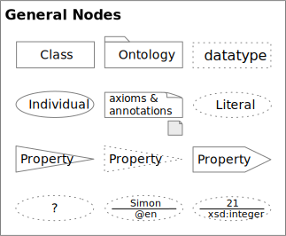
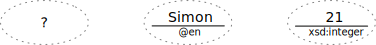
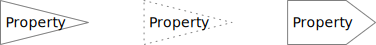

<!-- markdownlint-disable-file MD033 -->
# Nodes



<span class="figure caption">All Nodes</span>

## Classes


<span class="figure caption">A Class Node</span>

### Class Rules

1. The overall shape is a rectangle, it's **must** be greater than it's height,
   and corners **must** be hard, not rounded.
2. Node lines **must** be solid.

## Datatypes


<span class="figure caption">A Datatype Node</span>

### Datatype Rules

1. The overall shape is a rectangle, it's **must** be greater than it's height,
   and corners **must** be hard, not rounded.
2. Node lines **must** be dotted.
   1. More space must exist between dots than the width of the dots for clarity.

## Individuals


<span class="figure caption">An Individual Node</span>

### Individual Rules

1. The overall shape is an ellipse, it's **must** be greater than it's height.
2. Node lines **must** be solid.

## Literals


<span class="figure caption">A Literal Node</span>

### Extended Notation

```turtle
:thing :value "?" .

:thing :name "Simon"@en .

:thing :age "21"^^xsd:integer .
```



<span class="figure caption">Specific Literal Type Nodes</span>

### Literal Rules

1. The overall shape is an ellipse, it's **must** be greater than it's height.
2. Node lines **must** be dotted.
   1. More space must exist between dots than the width of the dots for clarity.
3. If the value is a `langString` a horizontal bar **must** separate the value above
   from the language identifier with the prefix `@` character.
4. If the value...
5. If the value (ellide...) ...

## Properties



<span class="figure caption">Properties as Nodes</span>

### Property Rules

1. The overall shape for Object and Datatype properties **must** be an isosceles triangle
   with a narrow base and with it's apex pointed to the right.
2. The overall shape for Annotation properties **must** be an *pointed flag*
   with a longer rectangle and trangular apex to the right.
3. Lables in all property nodes **must** be left justified so they are not lost in the apex.
4. Object and Annotation properties are represented with solid lines.
5. Datatype properties are represented with dotted lines.

## Axioms and Annotations


<span class="figure caption">Axiom and Annotation Nodes</span>

Notes:

1. Both Axiom and Annotation nodes have identical appearance and differ only in how they
   are associated to other nodes.
2. Both kinds of nodes can be elided to an icon form, an interactive tool may allow for
   clicking on the icon to edit the content inline or in a dialog.

### Axiom and Annotation Rules

1. The node's shape **must** be a *note*, a rectangle with a folded-over top-right corner.
2. Text content **must** be left-aligned, not centered.
3. Text content **may** be top-aligned rather than the usual vertical centering.
4. Axioms **must** be represented in a well-known and standard representation such as the
   OWL Functional Syntax or Manchester Syntax.
5. Annotations may be represented in **either** a tabular name/value form, or as textual
   "name=value" form.
6. The icon form of the note shape **must** be a small, square, note, and **must** be
   filled with a light shade (`#ebebeb` in our example).
7. As axiom content **may** be consider code-like, it is acceptable to use a monospaced
   code font as an alternative.
