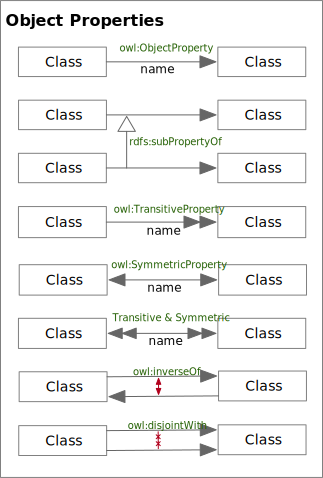
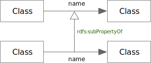

<!-- markdownlint-disable-file MD033 -->
# Object Properties

Object Properties, in general, are shown as directed edges between class nodes.

Object Properties

The following sections outline the notation for common property types, and
patterns.

## owl:ObjectProperty

An OWL *ObjectProperty* Edge

### owl:ObjectProperty Rules

TBD

## rdfs:subPropertyOf

An RDF Schema *subPropertyOf* Edge

### rdfs:subPropertyOf Rules

TBD

## owl:inverseOf

An OWL *inverseOf* Edge

### owl:inverseOf Rules

TBD

## owl:SymmetricProperty

A OWL *SymmetricProperty* Edge

### owl:SymmetricProperty Rules

TBD

## owl:TransitiveProperty

A OWL *TransitiveProperty* Edge

### owl:TransitiveProperty Rules

## owl:SymmetricProperty *and* owl:TransitiveProperty

An OWL *SymmetricProperty* and OWL *TransitiveProperty* Combined Edge

### owl:Symmetric/TransitiveProperty Rules

TBD
