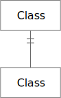

# Object Properties

Object Properties, in general, are shown as directed edges between class nodes.
The following sections outline the notation for common property types, and
patterns.

## owl:ObjectProperty

### owl:ObjectProperty Rules

TBD

## owl:equivalentClass

### owl:equivalentClass Rules

TBD

## owl:inverseOf

### owl:inverseOf Rules

TBD

## owl:disjointWith

### owl:disjointWith Rules

TBD

## owl:SymmetricProperty

### owl:SymmetricProperty Rules

TBD

## owl:TransitiveProperty

### owl:TransitiveProperty Rules

## owl:SymmetricProperty *and* owl:TransitiveProperty

## owl:Symmetric/TransitiveProperty Rules

TBD
