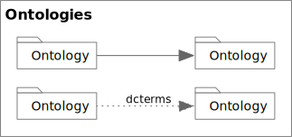
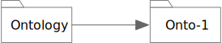
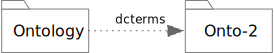

<!-- markdownlint-disable-file MD033 -->
# Ontology Relations

Corresponds to section 3.2 of the *OWL 2 Structural Specification*.

## Ontology Nodes



<span class="figure caption">Ontology Nodes and Edges</span>

### Ontology Node Properties

* `ontologyIRI` -- the **required** ontology IRI.
* `versionIRI` -- the optional ontology version IRI.

Additionally, there are the following specific annotation properties;
`owl:versionInfo`, `owl:priorVersion`, `owl:backwardCompatibleWith`, and
`owl:incompatibleWith`.

### Ontology Node Rules

1. The node's shape **must** be a *folder*, a rectangle with a small *tab* on the top-left corner, with *solid* lines.
   1. The diagram above shows the **preferred** form with a sloped rectangular tab on the left.
   2. The alternate, acceptable, form with a plain rectangular tab on the right.
2. An ontology node be the source of the following edges:
   1. Ontology imports.
   2. Ontology dependencies.
   3. General axioms.
   4. Annotation properties.
3. An ontology node be the target of the following edges:
   1. Ontology imports.
   2. Ontology dependencies.

## Imports



<span class="figure caption">Ontology Imports</span>

```owl
Ontology( 
    <http://www.example.com/importing-ontology>
    Import( <http://www.example.com/my/2.0> )
...
)
```

### Imports Rules

1. The edge **must** be a solid line with a *filled triangle* at the target.
2. The source and target **must** be Ontology nodes, and **must** be distinct.
3. There must be **at most** one edge between any pair of ontology nodes.
4. These edges have no labels.

## Dependencies and Prefixes



<span class="figure caption">Ontology Dependencies and Prefix Assignment</span>

```owl
Prefix(
    dcterms: = <http://purl.org/dc/terms/>
)
Ontology(
    <http://www.example.com/ontology1>
    Annotation( dcterms:title "An example" )
)
```

Note the example diagram also shows the annotation to show the usage of the
declared prefix "dcterms".

### Dependency and Prefix Rules

1. The edge **must** be a dotted line with a *filled triangle* at the target.
2. The source and target **must** be Ontology nodes, and **must** be distinct.
3. The edge may have a label, all labels originating from the same source
   ontology **must** be unique.
   1. As these are the prefix to qualified name it is not legal to include the
      colon (`':'`, Unicode `U+003A`) character in the name.
   1. This implies there can be **at most** one unlabeled dependency edge.

## Tool Notes

For **Visual Navigation** a navigable view of interconnected ontology nodes is
a good way to understand the manner in which they are used as well as the
popularity, or not, of those in your network. Additional graph metrics can help
provide insights as well as simple visualization.

The folder shape **must** not be used to render a preview of *the* ontology
diagram, given that we would encourage any non-trivial ontology to have any
number of diagrams as different views into the same ontology. In this way
the folder icon is chosen as a way to think of it as a collection of these
views.

In reading an Ontology and finding either imports or prefix declarations it is
possible, in fact preferrable to add a folder node, but may be not so preferrable
to fetch the associated resource (especially not to do so transitively!). This
means that tools should provide a way to represent ontology **States**; for example
those that have been *discovered* but is not actually resolved, *resolved* and
cached, and those moved from the cache to local a *workspace* for editing.
