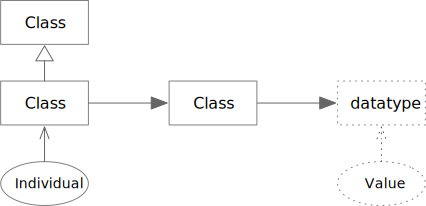
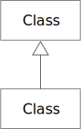
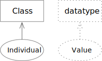

# Simple Edges

The edge between `Class` and `Class` represents an object property, described
in detail in [Object Properties](../object-properties/index.md). The edge
between `Class` and `datatype` is a datatype property and described in detail
in [Datatype Properties](../datatype-properties/index.md).

## rdfs:subClassOf

### rdfs:subClassOf Rules

TBD

## rdf:type

### rdf:type Rules

TBD
